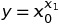

# LGP Tutorial 1: Configuration and Dataset

> *Running LGP on your own configuration and dataset without doing any programming

## Setup

This tutorial is based on the [tutorial](https://github.com/JedS6391/LGP-Tutorial/tree/develop/src/main/kotlin/lgp/tutorial/linearRegression) made by Jed Simson.

Please download **Main.kt**, **ProblemDefinition.kt**, **configuration1.json** and **dataset1.json** from this repository into a sub-directory of **LGP-Tutorials**, e.g. **NonProgrammingTutorial1ConfigurationAndDataset**.

In **NonProgrammingTutorial1ConfigurationAndDataset**, compile with

```
kotlinc -cp ../LGP.jar:../argparser.jar:../xenocom.jar -no-stdlib *.kt
```

## configuration.json

The configuration determines the environment in which your LGP runs. The tutorial is self-contained, however, if you'd like to better understand how LGP works, please refer to [this page](http://lgp-tutorial.jedsimson.co.nz/lgp/lgp.html) by Jed Simson and the book [A Field Guide to Genetic Programming](http://www.gp-field-guide.org.uk/).

Here we make our own json file for our configuration. The configuration determines the the environment in which LGP will run, including things like the operators used, the values of constants, whether each of the inputs and the outputs is categorical, etc.

Below is a minimum configuration file, taking advantage of the default parameters implemented in the API.

```
{
    "operations": [
        "lgp.lib.operations.Addition",
	"lgp.lib.operations.Subtraction",
	"lgp.lib.operations.Multiplication",
	"lgp.lib.operations.Division",
	"lgp.lib.operations.Exponent"
    ],
    "constants": [0.0, 1.0],
    "featuresBeingCategorical": [false, false],
    "outputsBeingCategorical": [false]
}
```

All the options and their brief explanations are shown below
Please note that you don't have to specify them all while using Kotlin instead of Java, as there are default values for them.
You can also find the explanation and the code [here](https://github.com/JedS6391/LGP/blob/master/src/main/kotlin/lgp/core/environment/config/Configuration.kt)

Option | Explanation
--- | ---
initialMinimumProgramLength | The minimum length of a program generated during population initialisation.
initialMaximumProgramLength | The maximum length of a program generated during population initialisation.
minimumProgramLength | The lower bound for program length during the evolution process.
maximumProgramLength | The upper bound for program length during the evolution process.
operations | A collection of fully-qualified class names specifying the classes of [lgp.core.evolution.instructions.Operation]s to be loaded into an [lgp.core.environment.Environment]. Please refer to the [implementation](https://github.com/JedS6391/LGP/tree/master/src/main/kotlin/lgp/lib/operations) for available operations. In a later tutorial we'll discuss how to make our own operations. Arithmetic operations include: Addition, Substraction, Multiplication, Division, Exponent. Bitwise operations include: Not, And, Or. Conditional operations include: IfGreater, IfLessThanOrEqualTo. There is also a Sine operator, i.e. "lgp.lib.operations.Sine".
constantsRate | The probability with which instructions in an LGP program will contain a constant value.
constants | Any values to be used as constants in an LGP program, e.g. "\[0.0, 1.0\]".
numCalculationRegisters | How many registers should be provided to an LGP program for calculation.
populationSize | How many individuals should the population contain.
featuresBeingCategorical | Whether each of the features is categorical, as categorical features will be vectorized. This MUST match the features provided in the dataset.csv file.
outputsBeingCategorical | Whether each of the outputs is categorical, as categorical outputs will be vectorized. This MUST match the outputs provided in the dataset.csv file.
crossoverRate | The frequency with which crossover should occur.
microMutationRate | The frequency with which micro-mutations should occur, i.e. rate of change below the instruction level.
macroMutationRate | The frequency with which macro-mutations should occur, i.e. rate of change on the instruction level.
generations | Number of generations to evolve.
numOffspring | Number of individuals that should be taken from the population for fitness tournaments in each generation.
branchInitialisationRate | How often branches should be included in evolved programs.
stoppingCriterion | Determines the threshold for stopping the evolutionary process. When a solution with a fitness of \[stoppingCriterion\] is found, the search will stop. By default, we don't stop until the fitness is minimised perfectly, reaching 0.
numberOfRuns | Provides the ability to pass in the number of runs as a configuration parameter instead of a hard-coded value in the problem definition. The parameter is not used by default anywhere in the system, but consumers can choose to use it. As LGP has some randomness in each individual run, multiple runs can be performed to better determine the effectiveness of the program and the configuration.

Some times these parameters require quite a bit tweaking for the program to get a good result, please adjust these parameters in the context of your dataset.

So we save our configuration file as "configuration1.json". If we want another configuration set, we can make another configuration file (e.g. "configuration2.json"), and we'll decide which to use in our command line argument.

## dataset.csv

The dataset is the data that you'd like to train your LGP with. Each sample in the dataset contains one or more features and one or more labels.

Suppose we have some data representing the non-linear function that  Please note, the features (x_0 and x_1) conforms with "featuresBeingCategorical" (both being numeric, so false for both) and the label (y) conforms with "outputsBeingCategorical" (being numeric, so false) in the configuration, also, the program we use treats the features and the label as double, so please use double values for this program. In a later tutorial we'll discuss how to make your own LGP that suits your data best.

We store the data points in a CSV file.

```
x_0,x_1,y
1.0,1.0,1.0
1.0,2.0,1.0
1.0,3.0,1.0
2.0,1.0,2.0
2.0,2.0,4.0
2.0,3.0,8.0
3.0,1.0,3.0
3.0,2.0,9.0
3.0,3.0,27.0
```

So we save our dataset file as "dataset1.csv". Just like the configuration, if we want another dataset, we can make another dataset file (e.g. "dataset2.json"), and we'll decide which to use in our command line argument.

## Run LGP on our own configuration and dataset

We can run the program using this format.

```
kotlin -cp ../LGP.jar:../argparser.jar:../xenocom.jar:. Main CONFIGURATION_FILENAME DATASET_FILENAME
```

So we run the program on the files we just downloaded.

```
kotlin -cp ../LGP.jar:../argparser.jar:../xenocom.jar:. Main configuration1.json dataset1.csv
```

After running our own configuration and dataset a few times, we may get a perfect result, indicated by "bestFitness = 0.0":
Please note that due to the stochastic nature of LGP, the result is likely to differ each time.

```
Results:
Run 1 (best fitness = 0.0)
r[5] = r[8] / f0
r[7] = r[3] / r[5]
r[9] = 0.0 * r[7]
r[2] = f1 + r[9]
r[0] = f0 ^ r[2]


Stats (last generation only):

generation = 9
bestFitness = 0.0
meanFitness = 1.9663361807047254E27
standardDeviationFitness = 1.629582581952018E28
meanProgramLength = 22.13
meanEffectiveProgramLength = 3.19
```

The simplicity of the function makes getting a perfect result relatively easy, while more complicated functions may require some adjustments to the evolutionary algorithm and the hyperparameters, for LGP to achieve good performance. We'll discuss how to work with those to make LGP work more efficiently in a later tutorial.

Three files are generated by the program, "linear_regression_experiment.c", "result.csv" and "testcases.txt". Please feel free to compare your results with mine, which are in this repository.

"linear_regression_experiment.c" is the best solution found by LGP, now as a C program, which takes the feature(s) as command line arguments, and will print its prediction of the label for you.

"results.csv" is the statistics collected in the running process, we can analyse it to get some ideas on how to tweak the hyperparameters and change our program to make it perform better. We'll discuss more about that in a later tutorial.

"testcases.txt" shows how the solution performs on the test cases.

## Try the generated C program

For now, we have successfully run LGP using our own configuration and dataset without doing any programming. Let's check out the C program generated by it.

First we compile it (we need the -lm to link to the math.h library):

```
gcc -o linear_regression_experiment linear_regression_experiment.c -lm
```

Then we test it on some feature values never used in the training process:

```
./linear_regression_experiment 4 5
```

The result is:

```
1024.000000
```

Which is correct as 4 to the power of 5 is 1024. We've got ourselves a C program for the function.
