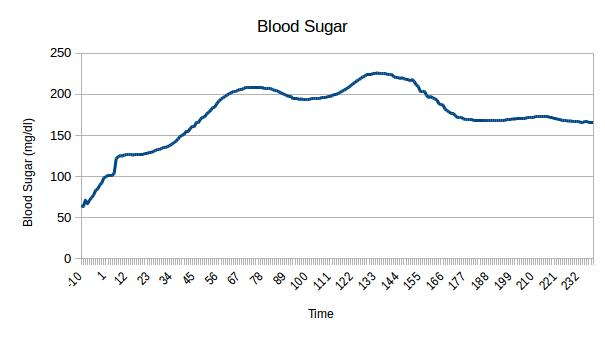

# LGP Programming Tutorial 1: Programming Introduction and Custom CsvDatasetLoader

> *Introduction to programming with the LGP API and making a custom CsvDatasetLoader for your dataset

## Overview

We will perform LGP on a time series dataset which contains minute-by-minute measurements of blood sugar levels (in mg/dl) of a type 1 diabetic patient attached to a continuous glucose monitoring system (CGM).

The series starts 10 minutes before a meal and shows the patient immediately heading into hyperglycemia (defined as >180 mg/dl) before insulin reduces the level back to the normal range (`<`180 mg/dl).



We want a program which can predict the blood sugar level given the time and a time window of a few previous blood sugar levels. For example, assuming the time window size to be 3, using the given time 10 and the blood sugar levels at times 7, 8 and 9, the program should predict the blood sugar level at time 10.

We will need three program files:
Main.kt to run the program
TimeSeriesExperiment.kt to define the problem, i.e. how LGP should be setup and run
TimeSeriesExperimentCsvDatasetLoader.kt to load our dataset

Please note, we need a custom dataset loader because of the specific way in which we want to format our data. The minimum for an LGP program is a main file and a problem definition file, and a good example would be the [linear regression experiment](https://github.com/JedS6391/LGP-Tutorial/tree/develop/src/main/kotlin/lgp/tutorial/linearRegression) program we used for our Non-Programming Tutorials, whose code this tutorial is based on.

## Running

Download **Main.kt**, **TimeSeriesExperiment.kt**, **TimeSeriesExperimentCsvDatasetLoader.kt**, **configuration.json** and **dataset.csv** from this repository into a sub-directory of **LGP-Tutorials**, e.g. **ProgrammingTutorial1ProgrammingIntroductionAndCustomCsvDatasetLoader**.

In **ProgrammingTutorial1ProgrammingIntroductionAndCustomCsvDatasetLoader**, compile

```
kotlinc -cp ../LGP.jar:../argparser.jar:../xenocom.jar -no-stdlib *.kt
```

Please note, LGP.jar contains the Kotlin standard library, so *-no-stdlib* is added to avoid warnings.

Run

```
kotlin -cp LGP.jar:argparser.jar:xenocom.jar:. Main configuration.json dataset.csv 3
```

The arguments used: the configuration file, the dataset file and the time window size. The number of features stated in the configuration file as featuresBeingCategorical is 4, which is the 3 previous blood sugar levels plus the given time. Please make sure the number of features is greater than the time window size by 1 when you experiment with different time window sizes.

## Analysis

Let's go through the program files to see how it performs LGP.

### Main.kt

There are 7 arguments in total, 5 of which are optional as they have default values. The user has to specify the configuration file and the dataset file. The program by default uses a window size of 3, SteadyState as the evolutionary algorithm and, if IslandMigration is used, an island number of 4, a migration interval of 10 generations and a migration size of 10 individuals.

```
class Arguments(parser: ArgParser) {

    val configurationFilename by parser.positional(
        name = "CONFIGURATION_FILENAME",
        help = "A file that contains configuration information for the system.")

    val datasetFilename by parser.positional(
        name = "DATASET_FILENAME",
        help = "A CSV file that contains a data set to run the experiment on.")

    val windowSize by parser.positional(
        name = "WINDOW_SIZE",
	help = "The size of the window for the time series.").default("3")

    val evolutionaryAlgorithm by parser.positional(
        name = "EVOLUTIONARY_ALGORITHM",
	help = "The evolutionary algorithm used by LGP.").default("SteadyState")

    val numIslands by parser.positional(
        name = "NUM_ISLANDS",
	help = "The number of islands the population should be split into, for IslandMigration.").default("4")

    val migrationInterval by parser.positional(
        name = "MIGRATION_INTERVAL",
	help = "The interval that solutions are migrated with, for IslandMigration.").default("10")

    val migrationSize by parser.positional(
        name = "MIGRATION_SIZE",
	help = "How many solutions migrate between islands at each interval, for IslandMigration.").default("10")

    init {
        try {
	    parser.force()
        } catch (ex: SystemExitException) {
            println("Invalid arguments: ${ex.message}")
            System.exit(ex.returnCode)
        }
    }

}
```

The testcases of the final solution by LGP are computed and output to the file **testcases.txt**. It should be noted that each output is a list of doubles as the output is a vector. In this case it's a vector of one value, but still need to be treated as a list. How the difference is computed is up to the programmer, here I define the difference between an actual output and the corresponding expected output to be the sum of the differences between their individual values.

```
private val verboseMSE = object : FitnessFunction<Double>() {

    override fun fitness(outputs: List<List<Double>>, cases: List<FitnessCase<Double>>): Double {
        val difference = cases.zip(outputs).map { (case, actual) ->
            val expected = case.target
            actual.zip(expected).map { (singleActual, singleExpected) -> Math.abs(singleActual - singleExpected) }.sum()
        }.average()

        File("testcases.txt").bufferedWriter().use { out ->

            out.write("The average difference is ${difference}.\n")

            cases.zip(outputs).map { (expected, actual) ->
                out.write("\tExpected: ${expected.target}, Actual: $actual\n")
            }

        }

        return 0.0
    }
}
```

The arguments are passed to the problem definition, and used to setup and run LGP.

```
val problem = TimeSeriesExperiment(
    configurationFilename = this.configurationFilename,
    datasetFilename = this.datasetFilename,
    windowSize = this.windowSize.toInt(),
    evolutionaryAlgorithm = this.evolutionaryAlgorithm,
    numIslands = this.numIslands.toInt(),
    migrationInterval = this.migrationInterval.toInt(),
    migrationSize = this.migrationSize.toInt()
)
```

LGP is run, the solution is returned. The dataset will later be used for the testcases.

```
problem.initialiseEnvironment()
problem.initialiseModel()

println("Running...")

val solution = problem.solve()
val dataset = solution.dataset
```

The statistics of each run are printed, e.g. best fitness, mean fitness, fitness standard deviation, etc.

```
println("Results:")

solution.result.evaluations.forEachIndexed { run: Int, res: EvolutionResult<Double> ->
    println("Run ${run + 1} (best fitness = ${res.best.fitness})")
    println(simplifier.simplify(res.best as BaseProgram<Double>))

    println("\nStats (last generation only):\n")

    for ((k, v) in res.statistics.last().data) {
        println("$k = $v")
    }
    println("")
}
```

The best solution is selected from all the runs, its testcases recorded, and is translated into a C program.

```
val bestPrograms = solution.result.evaluations.map { res: EvolutionResult<Double> -> res.best as BaseProgram<Double> }
val best = bestPrograms.minBy(BaseProgram<Double>::fitness)
this.printPassedTestCases(best as BaseProgram<Double>, dataset)
File("time_series_experiment.c").bufferedWriter().use { out ->
    val translated = translator.translate(best)
    out.write(translated)
}
```

### TimeSeriesExperiment.kt

The comments of this file are pretty explainatory, as what we need to do can be divided into 5 parts:
1. Give the problem a name and simple description.
2. Define the necessary dependencies to build a problem.
3. Describe how to initialise the problem's environment.
4. Specify which evolution model should be used to solve the problem.
5. Describe the steps required to solve the problem using the definition given above.

This time we are mostly using standard components provided by the API, in the next tutorial we'll look into using some components with extended functionality and making some custom components for a problem we want to solve.

### TimeSeriesExperimentCsvDatasetLoader.kt

This class is a subclass of DatasetLoader, and the load method returns a Dataset of specifically Double. It takes two arguments:
1. A reader that will provide the contents of a CSV file
2. The number of previous values we want to provide to LGP as features

```
class TimeSeriesExperimentCsvDatasetLoader constructor(
        val reader: Reader,
        val windowSize: Int
) : DatasetLoader<Double>
```

All the times are extracted from the CSV file, and then normalized. As the constant values our configuration file specifies are 0.0 and 1.0, and all the registers are initialized to 1.0 in our problem definition file, time values ranging from -10 to over 200 are easily too large for our constant and initialized values to make a difference, so normalizing them to 0.0 to 1.0 should help the performance. However, when we use our C program for prediction, we need to normalize those values as well before inputting them to the program.

```
val times: List<Double> = lines.map { line ->
    line[2].toDouble()
}

var timeMin = times.get(0)
var timeMax = times.get(0)

for (i in 1..(times.size - 1)) {
    if (times.get(i) < timeMin) { timeMin = times.get(i) }
    if (times.get(i) > timeMax) { timeMax = times.get(i) }
}

val normalizedTimes: List<Double> = times.map { time ->
    (time - timeMin) / (timeMax - timeMin)
}

val values: List<Double> = lines.map { line ->
    line[3].toDouble()
}
```

We extract the values and normalize them as well.

```
val values: List<Double> = lines.map { line ->
    line[3].toDouble()
}

var valueMin = values.get(0)
var valueMax = values.get(0)

for (value: Double in values) {
    if (value < valueMin) { valueMin = value }
    if (value > valueMax) { valueMax = value }
}

val normalizedValues: List<Double> = values.map { value ->
    (value - valueMin) / (valueMax - valueMin)
}
```

We repeat for each sample.

```
for (i in windowSize..(lines.size - 1))
```

We format the values in our time window as features, named **t-1**, **t-2**, **t-3**, etc.

```
val temp = MutableList(windowSize, { j -> Feature(name = "t-" + (windowSize - j), value = normalizedValues.get(i - windowSize + j)) })
```

We add the time to the list of features, after the values in our time window.

```
temp.add(Feature(name = "time", value = normalizedTimes.get(i)))
```

We finish making one sample and add it to the dataset's features.

```
features.add(Sample(temp))
```

We add the corresponding value to the dataset's targets.

```
targets.add(normalizedValues.get(i))
```

The Dataset is returned to be used for training.

```
return Dataset(features, targets)
```

## Results

Please take a look at the files generated by the program: **results.csv**, **testcases.txt** and **time_series_experiment.c**. Feel free to compare your results to the results in this repository, and compile and run the C program. Please refer to the Non-Programming Tutorial 2 for how to tweak the hyperparameters and the evolutionary algorithm.
