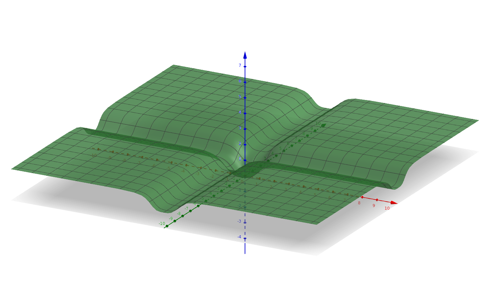
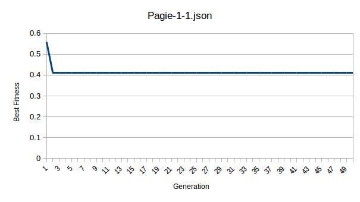
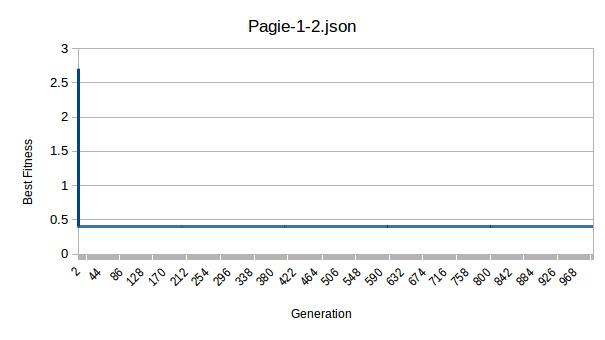
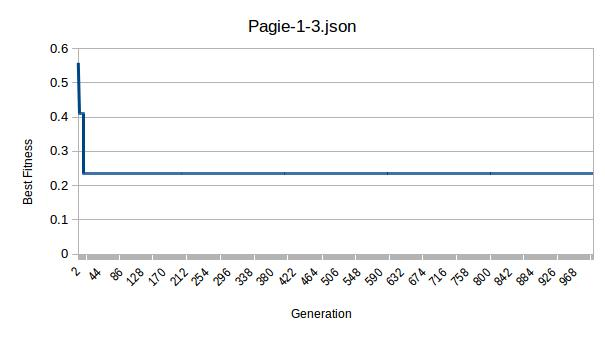
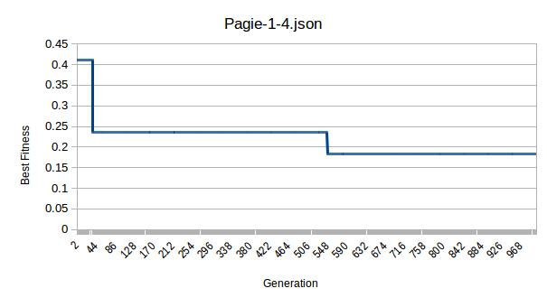
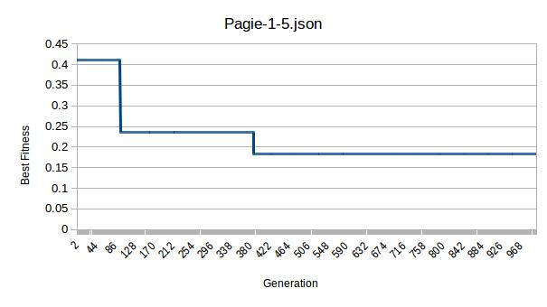
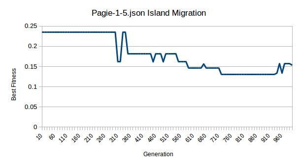

# LGP Tutorial 2: Evolutionary Algorithms and Hyperparameters

> *Choosing a suitable evolutionary algorithm and adjusting the hyperparameters for your dataset

## Setup

We will continue to use the setup we created in Tutorial 1, and this tutorial will be performed in the LGP-Tutorial directory, too.

This tutorial does not include programming. We'll perform LGP on a synthetic symbolic regression benchmark, the Pagie-1 ( = 1 / (1 + x0 ^ -4) + 1 / (1 + x1 ^ -4)"), defined by Pagie & Hogeweg in 1997). Which looks like



Please download the Pagie-1.csv file from this repository. This original dataset can be found [here](https://github.com/PonyGE/PonyGE2/blob/master/datasets/Paige1/Train.txt).

Please download the Pagie-1-1.json file from this repository. This configuration file mostly relies on the default hyperparameter values and only specifies the minimum information needed.

```
{
    "operations": [
        "lgp.lib.operations.Addition",
        "lgp.lib.operations.Subtraction",
        "lgp.lib.operations.Multiplication"
    ],
    "constants": [0.0, 1.0],
    "numFeatures": 2
}
```

We'll work from here.

## Run the default configuration

Now let's just run our configuration on our dataset.

```
kotlin -cp build/libs/LGP-Tutorial.jar: lgp.tutorial.linearRegression.Main Pagie-1-1.json Pagie-1.csv
```

## Experiment with the hyperparameters

We examine the output to see the performance. Generally, a lower best fitness means a better performance. I get a best fitness of 0.41.

If we inspect the expected and the actual values in testcase.csv, chances are that the program isn't doing a very good job. Let's take a look at the statistics in the results.csv file generated by the program. The file is named result1.csv in the repository.

Hmm, we can quickly spot a problem, the best fitness has never improved.



The fact is, the default generation number, 50, is too small for most of the problems, let's make the generation number 1000 in our json file and name it Pagie-1-2.json.

```
"generations": 1000
```

It is recommended that we keep the old file as a change may make the performance either better or worse.

```
kotlin -cp build/libs/LGP-Tutorial.jar: lgp.tutorial.linearRegression.Main Pagie-1-2.json Pagie-1.csv
```

After a few tries and inspecting result.csv and testcases.txt, we find that the performance is equally bad, and the best fitness stops improving after the first few generations or has never improved.



Maybe it's the operations we have, as the default set of addition, subtraction and multiplication is quite limited. Let's add division to our operations and see if anything improves.

```
"operations": [
    "lgp.lib.operations.Addition",
    "lgp.lib.operations.Subtraction",
    "lgp.lib.operations.Multiplication",
    "lgp.lib.operations.Division"
]
```

```
kotlin -cp build/libs/LGP-Tutorial.jar: lgp.tutorial.linearRegression.Main Pagie-1-3.json Pagie-1.csv
```

After a few tries, there are some better results. I get a best fitness of 0.23. Looks like division is one of the things we need.



We see that the fitness is improving, which is good, but once in a few hundred generations, which is a bit slow. We can give the program more registers, more variant program length, a bigger population and a greater number of offspring. So the program can search deeper and wider into the search space.

```
"initialMinimumProgramLength": 20,
"initialMaximumProgramLength": 100,
"minimumProgramLength": 5,
"maximumProgramLength": 500,
"numCalculationRegisters": 15,
"populationSize": 1000,
"numOffspring": 50
```

Let's see if that improves anything.

```
kotlin -cp build/libs/LGP-Tutorial.jar: lgp.tutorial.linearRegression.Main Pagie-1-4.json Pagie-1.csv
```

After a few tries, we find out the best fitness might differ quite a bit form run to run, but is in general better, as I get a best fitness of 0.15.



It should be noted that searching too deep or wide into the search space may take a painfully long time with little gain in performance, so please increase these hyperparameters bit by bit and observe the performance. Also, the greater the numCalculationRegisters, the bigger the search space, and if the search space is too big, the program might actually do worse, so please treat this hyperparameter with caution.

Let's try making the mutations more often and drastic, and see if anything improves.

```
"crossoverRate": 0.8,
"microMutationRate": 0.8,
"macroMutationRate": 0.8
```

```
kotlin -cp build/libs/LGP-Tutorial.jar: lgp.tutorial.linearRegression.Main Pagie-1-5.json Pagie-1.csv
```

After a few runs, seems it is not significantly better or worse, and I get a best fitness of 0.16.



In my experiments, making the mutations less often and drastic seemed to yield similar results.

## Experiment with the evolutionary algorithms

Here's something else we can try, as there's another evolutionary algorithm we can try, called Island Migration, which may help the performance by seperating the evolution process into islands. In Island Migration, each island runs its own LGP like the normal LGP we just performed, for a specified number of generations, then a specified number of individuals migrate to between islands. This process is repeated until the maximum number of generations is reached or a solution with a perfect fitness (i.e. 0) is found. This algorithm tends to maintain a greater diversity of individuals than our normal evolutionary algorithm (i.e. Steady State). Let's try it out. So we add a few more command line arguments, specifying that we want to use Island Migration, the number of Islands we want, the migration interval and the migration size. For example, here we have 4 islands, migration happens every 10 generations, and each time 10 individuals migrate from one island to another.

```
kotlin -cp build/libs/LGP-Tutorial.jar: lgp.tutorial.linearRegression.Main Pagie-1-5.json Pagie-1.csv IslandMigration 4 10 10
```

After a few runs, we can get more stable performance and I get a best fitness of 0.13.



## Summary

So we have managed to improve the performance quite a bit along the way, withour doing any programming.

It should be noted that LGP is stochastic, therefore different runs will give different results. You may need to do 3 to 5 runs to get an idea of how good a configuration is.

The moral of this tutorial is that things like hyperparameters and evolutionary algorithms can really help our program, and tweaking them according to our problem can make a difference. Though in most cases it requires careful consideration of what's happening underneath the hood, along with some patience, it is worth doing.
